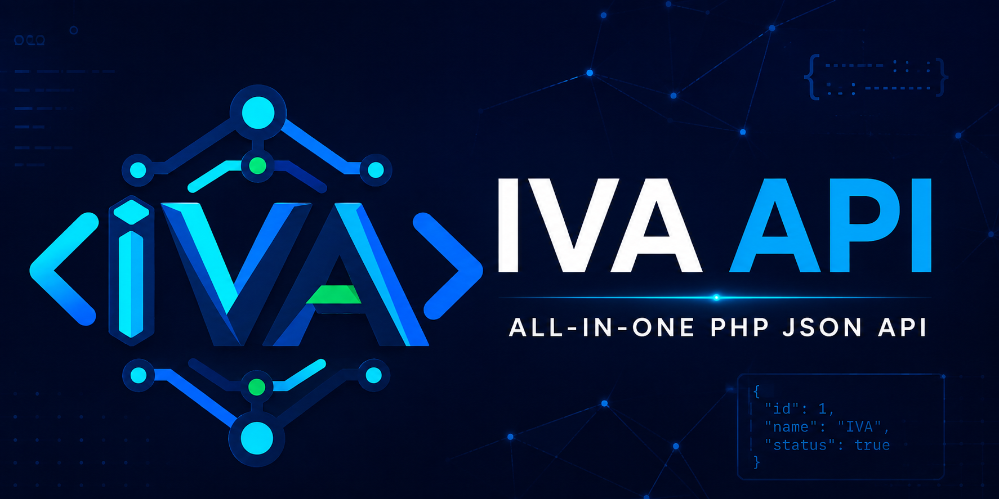

<p align="center">
  
</p>

# IVA API


یک وب‌سرویس چندمنظوره با PHP 8.1، مناسب نصب مستقیم روی cPanel؛ بدون Composer، Framework یا API Key اجباری. همه درخواست‌ها با `GET` و همه پاسخ‌ها با JSON هستند.

## امکانات

- دانلودر Instagram، YouTube و GitHub
- جستجوی ویکی‌پدیای فارسی و اخبار YJC
- نرخ ارز، طلا، Bonbast و رمزارز
- فینگلیش، برعکس‌کردن متن و اعتبارسنجی کد ملی
- تاریخ و ساعت، ذکر، حدیث و فال حافظ همراه تعبیر و صوت
- بیو، سخن بزرگان، چیستان، دانستنی و جوک تصادفی
- رابط HTML برای مشاهده و آزمایش endpointها
- محدودسازی درخواست بر اساس IP و پاسخ خطای یکپارچه

## نیازمندی‌ها

- PHP 8.1 یا جدیدتر
- افزونه‌های `curl`, `dom` و `json`
- افزونه `mbstring` پیشنهاد می‌شود
- Apache با `.htaccess` یا پیکربندی معادل

## نصب روی cPanel

1. محتوای پروژه را در `public_html/iva-api` آپلود کنید.
2. نسخه PHP دامنه را روی 8.1 یا جدیدتر بگذارید.
3. افزونه‌های موردنیاز را فعال کنید.
4. آدرس `https://example.com/iva-api/` را باز کنید.

بررسی سلامت:

```text
GET /iva-api/api.php?endpoint=health
```

## نمونه درخواست‌ها

```text
GET /iva-api/api.php?endpoint=media&url=https%3A%2F%2Fyoutu.be%2F_w9KUsfgGag
GET /iva-api/api.php?endpoint=wikipedia&q=تهران&limit=5
GET /iva-api/api.php?endpoint=hafez
GET /iva-api/api.php?endpoint=random%2Fjoke
GET /iva-api/api.php?endpoint=market%2Ftgju&symbol=price_dollar_rl
```

نمونه پاسخ:

```json
{
  "ok": true,
  "endpoint": "health",
  "data": { "status": "ok" }
}
```

فهرست کامل سرویس‌ها:

```text
GET /iva-api/api.php?endpoint=endpoints
```

## تنظیمات

محدودیت پیش‌فرض هر IP برابر ۳۰ درخواست در دقیقه است. مقدار `RATE_LIMIT_PER_MINUTE` را در ابتدای `api.php` تغییر دهید.

پارامتر عمومی provider اینستاگرام مقدار پیش‌فرض دارد و API Key خصوصی نیست. در صورت تغییر provider می‌توان آن را بدون ویرایش فایل تنظیم کرد:

```apache
SetEnv IVA_INSTAGRAM_AUTH "new-public-provider-value"
```

## نکات مهم

- لینک‌های دانلود ممکن است موقت باشند.
- providerهای خارجی می‌توانند ساختار یا سیاست دسترسی خود را تغییر دهند.
- فقط محتوایی را دانلود کنید که مالک آن هستید یا مجوزش را دارید.
- پروژه وابسته یا مورد تأیید Instagram، YouTube، GitHub یا سایت‌های منبع نیست.
- داده‌های محتوایی پوشه `data` از منابع عمومی متفاوت گردآوری شده‌اند؛ پیش از استفاده تجاری، مجوز محتوای موردنظر را بررسی کنید.

## مشارکت و امنیت

راهنمای مشارکت در [CONTRIBUTING.md](CONTRIBUTING.md) و روش گزارش امنیتی در [SECURITY.md](SECURITY.md) نوشته شده است. GitHub Actions نحو PHP را روی نسخه‌های 8.1، 8.2 و 8.3 بررسی می‌کند.

- [مرجع کامل endpointها](docs/API.md)
- [تاریخچه تغییرات](CHANGELOG.md)
- [راهنمای پشتیبانی](SUPPORT.md)
- [آیین‌نامه رفتاری](CODE_OF_CONDUCT.md)

## مجوز

کد پروژه با مجوز [MIT](LICENSE) منتشر می‌شود.
